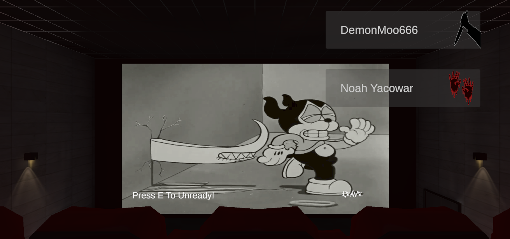
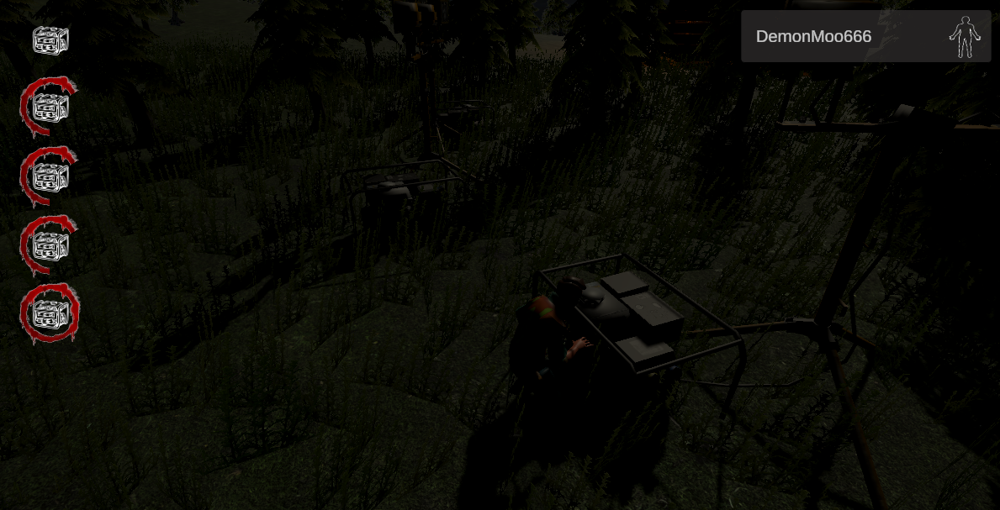

# Description

Welcome to this Unity coop horror game! You can expect a thrilling experience akin to the intense gameplay of popular titles in the genre. Players will find themselves immersed in a thrilling environment where teamwork, strategy, and quick decision-making are vital for survival.

The game revolves around a group of players who must work together to repair generators while being hunted by a persuing hunter. Each match is a test of skill and nerve as survivors must evade capture and certain death, while the hunter employs cunning tactics to ensnare and eliminate them.

## Features

- **Generator Repairing:** Players must cooperate to repair generators scattered throughout the map to power exit gates and escape.
- **Lobby System:** Seamless matchmaking and lobby management for players to join or host games, customize settings, and invite friends.
- **Player States:** Players can be in one of several states during gameplay, including Alive, Dead, Escaped, and Disconnected. Each player's state is determined server-side.
- **Handling Disconnections:** Robust system for handling player disconnections gracefully, ensuring minimal disruption to ongoing matches.

## Screenshots

### Menu and Lobby 

### Gameplay

### Survivor Status Symbols

## Getting Started

To get started with this game, follow these steps:

1. Clone the repository from https://github.com/noah-yacowar/Multiplayer-Horror-Game.
2. Open the project in Unity.
3. Set up multiplayer networking using Unity's Netcode for game objects.
4. Customize game settings and assets to suit your preferences.
5. Build and deploy the game for your platform of choice.
6. Invite friends or join public matches to start playing!

## Contributing

Contributions are welcome! If you have suggestions, bug reports, or would like to contribute code, please follow these guidelines:

1. Fork the repository.
2. Create a new branch for your feature or bug fix.
3. Make your changes and test thoroughly.
4. Submit a pull request with a clear description of your changes.

## Contact

For questions, support, or inquiries about this game, please contact me at noahyacowar@gmail.com.
